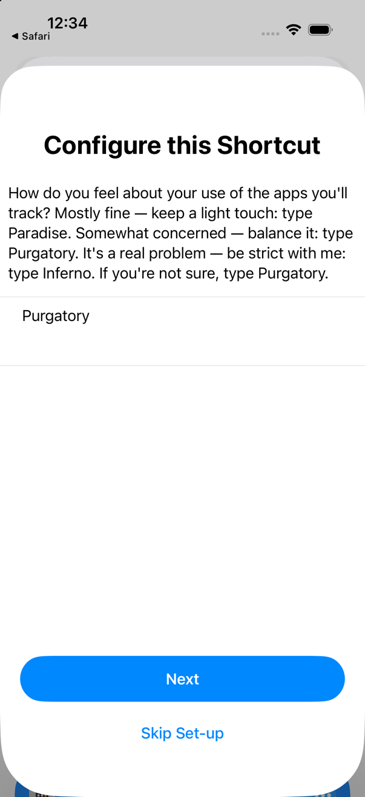
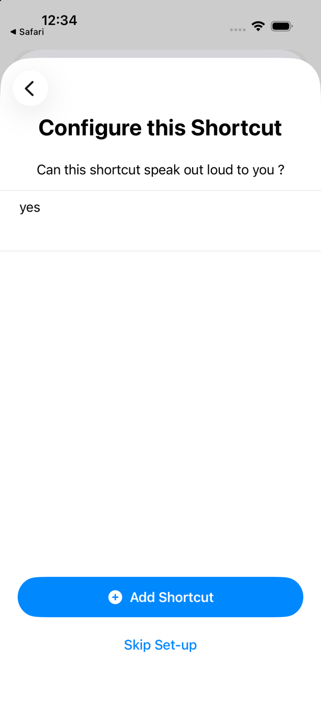
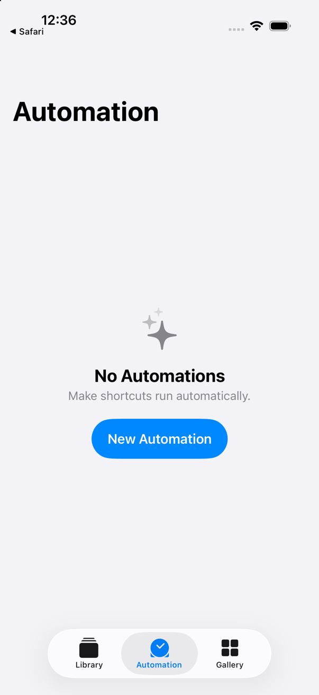
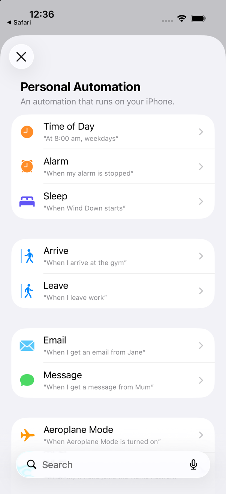
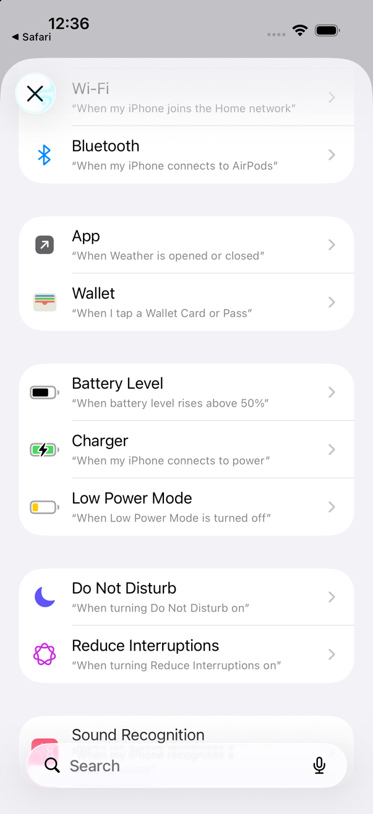
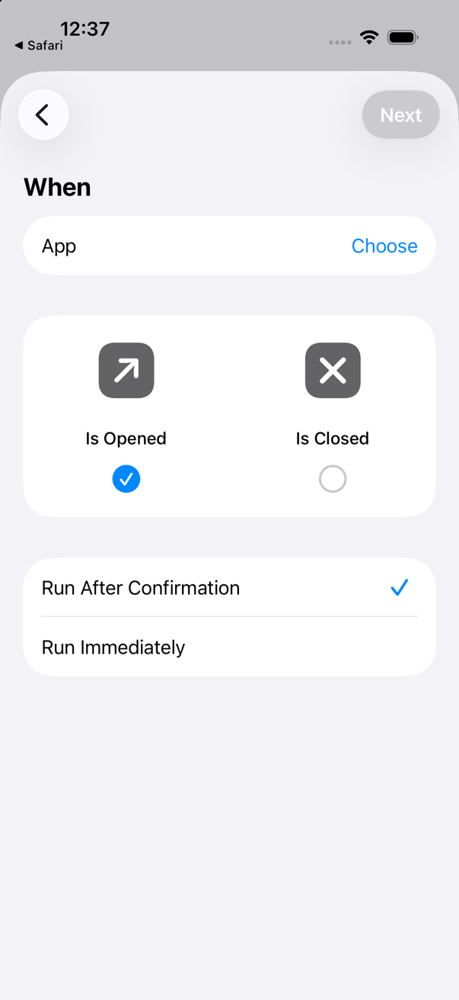
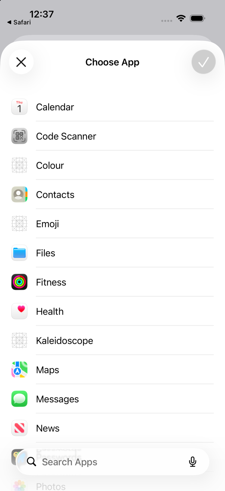
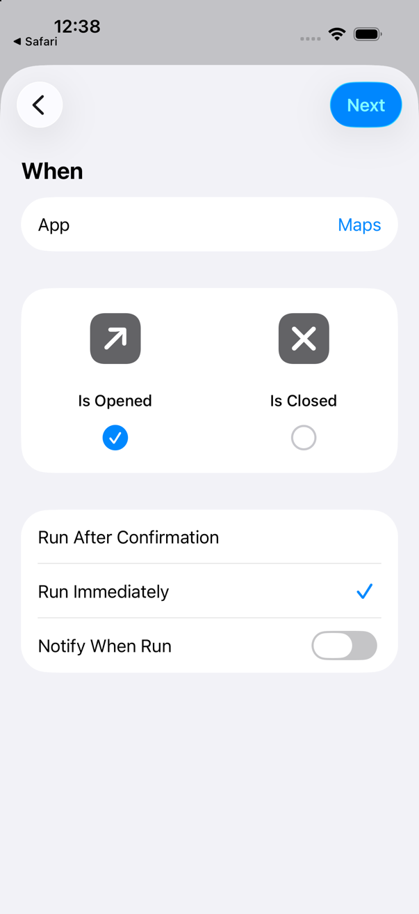

# PROSOCHĒ

A free iPhone shortcut that puts a pause between you and the apps you choose. Early test build.

PROSOCHĒ learns what helps you use your attention intentionally.

PROSOCHĒ · Created by Dougal Hanson · [dougalhanson.com/prosoche](https://dougalhanson.com/prosoche) · Version 0.1.0 · Source: [github.com/dougal441/prosoche](https://github.com/dougal441/prosoche)

## What it does

You choose the apps. Each time you open one, PROSOCHĒ looks at how often and how quickly you have been coming back, and responds in proportion. Most of the time that means nothing at all. Sometimes it is a light touch, a question, or stepping in. If you say how long you mean to stay, opens inside that time stay silent. It can offer you somewhere better to go, and it remembers, on your phone, which ways out you take. More in [How it works](docs/HOW-IT-WORKS.md).

## This release

The file is [release/PROSOCHĒ.shortcut](release/PROSOCHĒ.shortcut), version 0.1.0, 160,494 bytes.

SHA-256: `fa107e2974025c38ed80ee3cdc8f4122523ebc4e607dfe7d42704fa0ec1cba99`

It was made from [source/PROSOCHE.xml](source/PROSOCHE.xml).

You can check both yourself: [docs/VERIFY.md](docs/VERIFY.md).

## Install

### Before you start

This build has only been tried on iOS 26. Older versions are untested.

You need:

- An iPhone running iOS 26 or later.
- The Files and Shortcuts apps. Both are free from the App Store if either is missing.
- iCloud Drive turned on. PROSOCHĒ keeps its memory there.

Not sure which version you have? Open Settings, then General, then About, and look at iOS Version.

### Get it

The easiest way is [dougalhanson.com/prosoche](https://dougalhanson.com/prosoche). It gives you the file with exactly the right name. You can also take [release/PROSOCHĒ.shortcut](release/PROSOCHĒ.shortcut) from this repository.

1. Tap Download PROSOCHĒ. Your phone asks if you want to download the file. Tap Download.
2. Nothing opens by itself. Open Safari's downloads (the download icon by the address bar, or Safari's menu, then Downloads) and tap the file. Shortcuts opens.
3. Tap Set Up Shortcut. It asks two quick questions, and the suggested answers are fine. Keep the first answer and tap Next, then keep the second answer and tap Add Shortcut.





If the shortcut in your library is not named exactly PROSOCHĒ, touch and hold it, choose Rename, and type PROSOCHĒ. The automations below look for that name.

### Open the Note

1. Open the Shortcuts app and tap PROSOCHĒ once. A menu appears. Choose Read Me.
2. Allow every prompt it shows you. The Note titled PROSOCHĒ opens.
3. Scroll to the section headed "Setting up PROSOCHĒ — one time" near the bottom. It has these same steps, if you would rather follow along there.

### Automation A — when an app is opened

Build this in the Shortcuts app. You need two automations in total. Put every app you want watched into this one.

1. Open the Shortcuts app.
2. Go to the Automation tab, and tap New Automation.

   

3. Tap Personal Automation.

   

4. Scroll down the list to App and tap it. It sits below the first screenful, so you have to scroll to it (seen on the iOS 26.5 simulator).

   

5. On the When screen, tap Choose beside App (seen on the iOS 26.5 simulator).

   

6. In Choose App, tap the Search Apps box, type an app's name, and tap it in the list to tick it. Close the keyboard before you search for the next app. When you have ticked them all, confirm with the ✓ button at the top right (seen on the iOS 26.5 simulator).

   

7. Keep Is Opened. It is already selected beside Is Closed (seen on the iOS 26.5 simulator).
8. Choose Run Immediately, not Run After Confirmation. A switch called Notify When Run appears. Leave it off (seen on the iOS 26.5 simulator).

   

9. Tap Next at the top right (seen on the iOS 26.5 simulator).
10. The next screen asks you to pick a shortcut. Do not pick one. Tap Create New Shortcut instead.
11. Search to add a Text action and type Open into it.
12. Close the keyboard. Below the Text action, add the Run Shortcut action. Tap its light-blue word "Shortcut" and choose the one named PROSOCHĒ.
13. Save with the blue checkmark.

> **Before you tap play**
>
> Three small things may happen on screen, and each one undoes itself. You do not need to do anything. The screen flashes grey and back for a moment: PROSOCHĒ is testing a colour setting and turning it straight back off. Your media volume may dip and return to what it was. Your screen brightness may dip and return the same way.
>
> Allow every prompt it shows you. It may ask about sending a notification, saving a file, opening a link, searching the web, and changing a display colour setting.

Now tap the ▶ (Play) button on Automation A once, and allow everything.

### Automation B — when an app is closed

Build a second automation the same way, with two differences: Is Closed in place of Is Opened, and Close typed into the Text action in place of Open.

1. Open the Shortcuts app, go to the Automation tab, tap New Automation, and choose Personal Automation, then App.
2. On the When screen, tap Choose, search for the same apps as Automation A, tick each one, and confirm with ✓.
3. Choose Is Closed, not Is Opened.
4. Choose Run Immediately, not Run After Confirmation. Leave Notify When Run off, then tap Next.
5. Tap Create New Shortcut. Do not pick an existing one.
6. Add a Text action and type Close into it.
7. Below the Text action, add the Run Shortcut action. Tap its light-blue word "Shortcut" and choose the one named exactly PROSOCHĒ.
8. Save with the blue checkmark.

Tap the ▶ button on Automation B too, and allow everything it asks. It may ask about saving a file and changing a display colour setting.

### If something fails

If you see "Automation failed … took too long to run", a question went unanswered. Your install is not broken. Run Setup Check from PROSOCHĒ's manual menu, then tap ▶ on that automation again.

If your screen stays dim, quiet or grey, open PROSOCHĒ in the Shortcuts app and choose Emergency Restore.

Both automations are on. That's the whole setup.

### Already have an older copy?

When Shortcuts says you already have a shortcut with this name, choose Replace, never Keep Both. Keep Both makes a second shortcut with a 2 on the end, and your automations keep running the old one.

Replace on its own is not always enough. Afterwards, look in the Shortcuts library for two PROSOCHĒ tiles. If there are two, delete the older one. If your automations stop working after that, open each one and point its Run Shortcut action at the PROSOCHĒ that remains.

If you had an older version with a longer name, the new file installs as a separate shortcut and your automations keep running the old one. Open each automation and point its Run Shortcut action at PROSOCHĒ.

<details>
<summary>On iOS 27 instead</summary>

Make a shortcut that runs PROSOCHĒ whenever one of your apps is opened.

Make a second shortcut that runs PROSOCHĒ whenever one of your apps is closed.

Open the Shortcuts app and tap the Add button. Build each one so it ends up looking like the example below.

It should end up looking like this:

```
When your apps are Opened
Text: Open
Run Shortcut: PROSOCHĒ
```

```
When your apps are Closed
Text: Close
Run Shortcut: PROSOCHĒ
```

On iOS 27, PROSOCHĒ can take a little while to appear after an app opens.

These steps have not been walked on iOS 27 yet.

</details>

## Privacy, in short

- What PROSOCHĒ remembers is one file in iCloud Drive and one Note, on your phone and in your own iCloud. PROSOCHĒ itself sends nothing anywhere.
- No analytics, no account, no ads.
- This release uses no AI model and makes no model call.
- You are in charge. Turn off an automation or delete the shortcut at any time. It is a nudge you set up for yourself, not a lock.

The full statement is in [docs/PRIVACY.md](docs/PRIVACY.md).

## Known limitations

- It can be switched off, by design. It is a nudge, not a lock.
- It acts when you open or close an app, never in the middle of a session.
- It has only been tried on iOS 26.
- Screen, sound and colour changes are put back when PROSOCHĒ is done. That is still being checked on phones.

The full list is in [docs/KNOWN-LIMITATIONS.md](docs/KNOWN-LIMITATIONS.md).

## Check it yourself

Everything in this release can be recomputed with tools already on your Mac: [docs/VERIFY.md](docs/VERIFY.md).

## Contributing and changes

See [CONTRIBUTING.md](CONTRIBUTING.md) and [CHANGELOG.md](CHANGELOG.md). The shortcut is produced by a private generator, and this repository carries the exact XML that was signed.

## Licence

PROSOCHĒ is source-available, free for noncommercial use, under the PolyForm Noncommercial 1.0.0 licence, copyright (c) 2026 Dougal Hanson. It is free for any noncommercial purpose: personal use, study, sharing, forking. Commercial use is not licensed. See [LICENSE](LICENSE).
